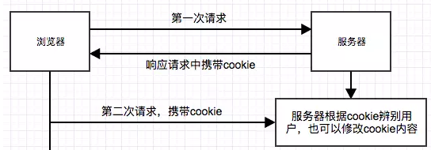

# 储存、缓存

## cookie

### 描述：
- 它的本质工作是帮助服务器维持与浏览器的状态，存储了一些数据(通常经过加密)
- 会随着HTTP请求在浏览器和服务器之间交互
- 大小不超过4K，以键值对的形式存在
- 应用场景
- - 记住密码，下次自动登录
- - 记录用户当前的某些，如选购的商品等
- - 记录用户的浏览数据 
### 产生方式
1. js产生(只能增加，不能修改)
```
document.cookie = 'userName=care';
document.cookie = 'age=20;domain=.baidu.com';
```
得到的总的cookie是一串字符串(如掘金的cookie)  
```
"_ga=GA1.2.1254708846.1554103103; gr_user_id=694b4afe-4d13-470e-baef-20b1203535f2; _gid=GA1.2.398372073.1555493550; gr_session_id_89669d96c88aefbc=5a0bc96b-14db-4a46-8d93-ac0eb566057c; Hm_lvt_93bbd335a208870aa1f296bcd6842e5e=1554795711,1555030330,1555493551; Hm_lpvt_93bbd335a208870aa1f296bcd6842e5e=1555493551; gr_session_id_89669d96c88aefbc_5a0bc96b-14db-4a46-8d93-ac0eb566057c=true"
```
### 获取cookie
`document.cookie`返回一个字符串  
如果要获取中间特定的部分，要写一个函数来处理这个cookie字符串  

## sessionStorage
### 描述
随着页面一同产生和消失
同一协议，同一主机，同一端口，同一窗口就可以访问 
所有同源窗口共享(当前窗口)  
大小5M左右  
### 使用
```
sessionStorage.setItem('name','world'); //设置键值对name为world
sessionStorage.getItem('name'); //获取键名为name对应的数据
```

## localStorage
### 描述
同一主机，同一协议，同一端口就可以访问
数据长期存在  
大小5M左右  
### 使用
将一些不变的数据放在客户端，提高首屏渲染的速度  
```
localStorage.setItem('name','world'); //设置键值对name为world
localStorage.getItem('name'); //获取键名为name对应的数据
```

## IndexedDB
这个以后用到再写吧  

# 缓存
## Service Worker
是运行在浏览器背后的独立线程，传输协议必须为https

## Memory Cache
内存中的缓存，一旦我们关闭 Tab 页面，内存中的缓存也就被释放了  
## Disk Cache
存储在硬盘中的缓存  
对于大文件来说，大概率是不存储在内存中的，反之优先  
当前系统内存使用率高的话，文件优先存储进硬盘  

## Push Cache

## 缓存的过程

浏览器每次发起请求，都会先在浏览器缓存中查找该请求的结果以及缓存标识  
浏览器每次拿到返回的请求结果都会将该结果和缓存标识存入浏览器缓存中  
## 强缓存
不会向服务器发送请求，直接从缓存中读取资源。只要缓存时间没过，直接用(不管服务端文件是否更新)
强缓存可以通过设置两种 HTTP Header 实现：Expires 和 Cache-Control  
**Expires**: 是http1.0的产物
Expires: Wed, 22 Oct 2018 08:41:00 GMT表示资源会在 Wed, 22 Oct 2018 08:41:00 GMT 后过期   
**Cache-Control**：是http1.1的产物，如果和Expires同时存在，该响应头优先级更高  
public：表示响应客户端和代理服务器都可以缓存  
private：表示只有客户端可以缓存  
no-store：不缓存
no-cache：资源被缓存，但是立即失效，使用的时候需要向服务器询问资源是否过期  
max-age=30：缓存30s就过期，需要重新请求
s-max-age=30：覆盖max-age，作用一样，但是只在代理服务器中生效
max-stale=30：缓存失效30s内，还是可以使用该缓存
min-fresh=30：要求代理服务器返回至少30s的缓存资源，超过30s的，无法作为响应返回

## 协商缓存
但强缓存失效后，浏览器携带缓存标识向服务器发送请求，由服务器决定是否使用缓存的过程  
协商缓存生效，返回304和Not Modified  
协商缓存失效，返回200和请求结果  
协商缓存可以通过设置两种 HTTP Header 实现：Last-Modified 和 ETag  
Last-Modified: Fri, 22 Jul 2016 01:47:00 GMT   服务器上该资源最后的修改时间

**参考文章**
[深入理解浏览器的缓存机制](https://github.com/ljianshu/Blog/issues/23)


