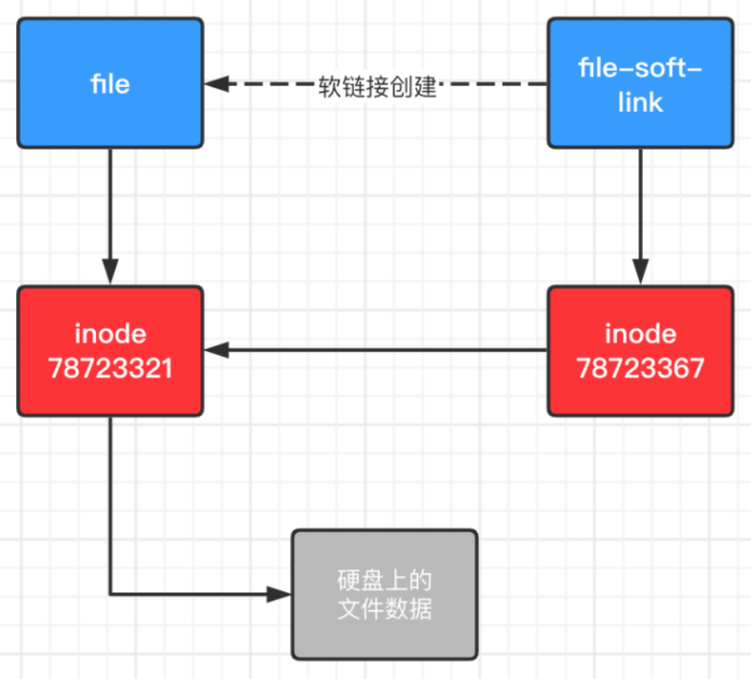
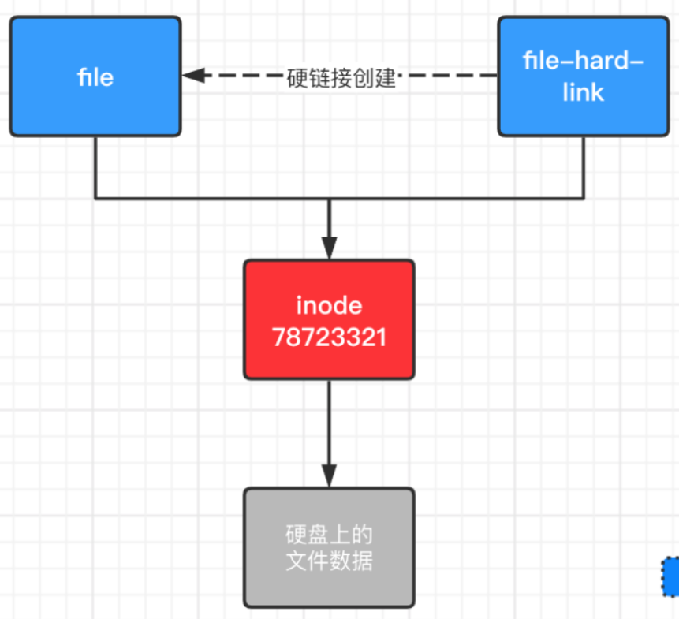

# 链接
文件存储在硬盘上，最小的储存单位叫做"扇区"(sector)  
每个"扇区"储存512字节  
操作系统在读取硬盘的时候是一次性连续读取多个扇区  
一次性读取的连续的多个扇区就是"块"(block)
"块"的大小最常见的是4KB，即连续8个sector组成一个block

储存文件的元信息的区域叫做"索引节点"(inode)
- 文件的字节数
- 文件的所有者ID
- 文件的用户组ID
- 文件的读写执行权限
- 文件的时间戳
  - ctime inode上一次变动的时间
  - mtime 文件的内容上一次变动的时间
  - atime 文件上一次打开的时间
- 链接数 有多少个文件名指向这个inode
- 文件数据block的位置

## 软链接(soft link)

## 硬链接

## 命令
ln