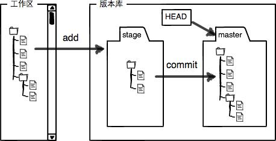

# Git

## Git相关的软件
- lazygit

## Git配置
ssh-keygen -t rsa -C "71073534@qq.com"　生成SSH Key    
id_rsa是私匙 id_rsa.pub是公匙（公匙和私匙的作用，属于密码学，百度！）   
git config --global user.name "care526Lj"　配置user.name   
git config --global user.email "710783534@qq.com"　配置user.email   

## 项目初始化
git init　　初始化版本库  
配置需要版本控制的文件/目录和要忽略的文件/目录  
在工作目录创建 .gitignore 文件  
*.zip　 　 ＃忽略所有以 .zip 结尾的文件  
!lib.zip　 ＃lib.zip文件添加到版本控制  
build/　　  #忽略build目录下的所有文件  
doc/*.txt   #忽略doc目录下的所有以 .txt 结尾的所有文件  

当某个文件已经添加到git了，中途又添加到忽略文件中，以下代码让忽略文件重新生效  
```bash
git rm -r –-cached .  
git add .  
git commit -m "Refresh adding .gitignore file"  

git rm -rf --cache 文件/文件夹
```

## 远程仓库
git remote add origin git@github.com:care526/learnGit.git　  
为当前仓库添加远程仓库，后面的一长串是该远程仓库的地址  
也可以用https的地址，如https://github.com/care526/learnGit.git  
origin是远程库的默认name，也可以改成别的名字  

## 克隆
git clone .git name  由某版本库克隆生成一个新的目录     
git clone git@github.com:care526/learnGit.git　克隆远程库到本地   

## 版本提交／查看／回退／撤销    
   
git add xxx　　添加某文件到暂存区，可使用多次添加多个文件   
git add .　　添加所有文件   
git commit -m "xxx"　　将添加到暂存区的文件更新同步到版本库   
git push -u origin master　　将本地库的内容推送到远程库（第一次提交要加-u,之后可以省略）  
git push -f XXXXXX   强制将本地代码覆盖远端的代码，会将之前的提交记录都清除，所以在实际开发中是不要使用的

git status　　查看当前的修改了那些文件    
git diff filename　　查看具体修改了什么内容， filename是文件名  
git log　　查看版本推送更迭历史记录   
git log --pretty=oneline　　同上，简化输出    
git log --graph --pretty=oneline --abbrev-commit　　同上，还可以看到分支的合并情况    
git log --stat --summary　查看每一次版本的大致变动情况       
git show dfb02e6e4f2f7b573337763e5c0013802e392818（版本号）　查看该版本的更新信息，也可以只写该版本的前几位dfb02e   
git show HEAD^ ## 查看 HEAD 的父版本更新细节   
git show HEAD^^ ## 查看 HEAD 的祖父版本更新细节      
git show HEAD~4 ## 查看 HEAD 的上四个版本更新细节    
git tag v0.1 dfb02　对dfb02版本生成一个自定义的版本号，对未来发布有好处   
git reflog　　查看每一次的记录      

git reset --hard HEAD^　　回退到上个版本   
git reset --hard HEAD^^　 回退到上上个版本（^的个数以此类推）   
git reset --hard HEAD~10 回退到上10个版本（免得 ^ 写的太长）   
git reset --hard commit_id 回退到指定版本，commit_id是某个版本号（版本号很长，可以只写前面几位）   
// reset 会使会退版本之后的都清除
git revert -n 版本号
// revert 只会将该版本的修改从分支中去掉，保留其他版本的变动，然后生成一个最新的版本，其他版本都在该版本之后

git checkout -- a.txt　　将a.txt的修改撤销，a.txt会自动回到修改前的状态   
两种情况，如果已经add了，那么将会回到暂存区里的文件内容，如果没有，将回到工作区修改前的状态，总之，就是回到最近的一次的git commit 或 git add的状态   
git reset HEAD filename　　将某个文件从暂存区的修改回退到工作区（如果是上面的第二种情况，就先用这个命令回到暂存区的修改状态，再回到工作区的修改状态）   
git rm filename　　删除某个文件，之后再commit就行了（如果用rm删除，要先git add . 再git commit）   

## 分支
创建分支的目的是在不影响主分支的情况下进行开发，在分支完成的时候将分支的内容和主分支合并即可   
git checkout filePath   还原未提交的该文件到上次提交   
git checkout .   还原未提交的所有文件到上次提交  
git checkout -b dev　　创建dev分支，并切换到该分支（等于上面两个命令之和）   
git merge dev　　合并dev分支到当前分支   
git merge --no-ff -m "XXX" dev　　将dev分支合并到当前分支（不采用Fast forward模式），并创建commit描述，提交一次，XXX是这次提交的修改内容   
git push --set-upstream origin dev　　在远程库创建分支并推送   

如果当前分支和主分支都提交的修改，但是修改的内容是不同的，我们在合并分支的时候就会发生冲突（相同文件的内容冲突），我们要手动修改两个分支为相同，然后才能合并分支，再删除   

修改某个分支的bug的时候，先在当前分支分一个分支，在分好的分支上进行修改，修改完了合并分支，再删除分出来的分支。
开发新功能的时候，也是先分一个功能分支，开发实验结束后再合并，删除，流程同bug分支    

git 不允许提交空目录。 但是业界有一个hack的方式。 就是在你想要提交的空目录新建一个文件隐藏文件(以.开头)，这样就不是空目录了。 而这个文件名我们一般叫做 .gitkeep  
  
git push origin master　　推送主分支到远程库   
git push origin dev　　推送dev分支到远程库   
git checkout -b dev origin/dev　　拉取远程库的分支到本地并切换   
git pull　　抓取远程库的新提交到当前工作区
git fetch   抓取远程库的新提交到本地库  
git branch --set-upstream dev origin/dev　　建立远程库分支与本地分支的关联   
当其他人对你要用的分支做了提交，远程库的分支领先于你的本地分支，要先拉取远程库的分支与本地合并，再做开发。如果拉取的分支和当前有冲突，要先解决冲突。 

合并分支的时候，发生冲突，解决完冲突后，已经合并，只需要commit一下就ok了

## 分支策略
- 开发/测试/线上 三个分支的方式
  每个人的所有开发都在master(线上)分支上拉取本地分支开发
  本地开发完成，将分支代码合入UAT(测试)分支供测试
  测试完成，检测是否可以自动合入master分支，如果不可以，用本地分支merge master分支，解决冲突，解冲突的过程中，询问冲突代码的之前开发人员，避免多次上线代码被冲掉，合入master
  分支开发完成，删除远程分支，本地分支保留一小段时间再删除，避免上线有问题，代码回滚，可立即重新上线
  UAT分支定期删除，从master分支拉取本地UAT分支，推送到远端
  ps: 本地开发的小技巧，前提是不需要和后端对接口的开发可以这样做
  如果后端使用cookie保存登录状态
  只要本地的域名配置为和代理（测试服/正式服）的域名一致，那么本地就可以访问代理的接口了
  hosts不要忘记配置了

## git 流程规范
   

是以一个git分支的生命周期来规范
- 建立分支
  从master拉取分支
- 分支开发，不断提交
- 分支使用`git merge --squash xxx`合并dev，测试
  测试有问题如何处理：
  1. 当前合并后面没有新的提交
     本地dev回退一个版本，重新合并修改的开发分支  
  2. 当前合并后面有新的提交
     - 本地dev回退到自己合并前的一个版本，重新合并修改的开发分支
       并通知后面的功能开发者，重新合并提交
     - 或者先通知后面的功能开发者合并代码，自己后面再合并  ---
- 分支对应的功能点合并进master，分支删除

### 分支命名
- **分支类型**
  | 分支类型 | 解释 |
  |:-:|:-:|
  | feature | 功能开发 |
  | hotfix | 紧急热修复 |
  | docs | 文档变更 |
  | config | 配置文件修改 |
如果有多个类型的修改，以**feature**、**hotfix**为主  
- **命名规范**
  **type-name-func**    
  例：feature-lj-task-center   任务中心功能开发  
  type：开发分支类型    
  name：开发者名字首字母    
  func：具体的开发任务    

### 代码提交
`git commit -m "xxxx"`
规范提交内容  
- 本地开发提交
  这里提交内容最终会被废弃  
  作用：帮助开发自己明确每次提交的修改内容
  1. day: xxx       日常提交
  2. stage: xxx     阶段提交
  ```bash
  git commit -m "day: 修改商品版块"
  git commit -m "stage: 完成商品版块"
  ```
     
- 合并dev分支提交
  ```bash
  git commit -m "
  version: 1.1.1

  feature: app任务中心版块优化

  修改范围只限于任务中心版块，提取所有任务的配置文件到public/json目录

  项目经理：xxx 产品：xxx 研发：xxx 测试：xxx
  "
  ```
     

### 版本号
> 1.1.1  大号.中号.小号
- **开发任务下达**的时候，指定修改等级  
- **开发完成**
  1. 在dev分支 merge 开发分支的时候，修改版本号，对应等级版本加1  
  2. 在master合并hotfix分支的时候修改版本号，小号加1
     ps：即使是之前撤销的分支重新合并也加1，始终比上一个版本高即可  
- master合并代码的时候
- 删除对应开发分支的远程分支

## github
### 加速服务
- https://hub.fastgit.org