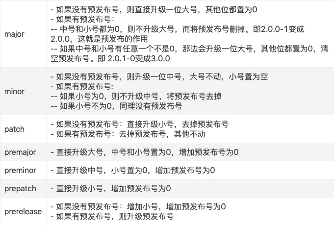

# NPM

[npm文档](https://www.axihe.com/api/npm/api/api.html)
### init
- npm init
  初始化当前项目，指定作者，包名等基础信息
- npm init --yes
  同上，直接使用默认数据，不再一一询问

### install / i(别名)
- npm i packageName
  安装packageName包，默认添加到dependencies里，默认npm仓库最新版本
- npm i packageName -S/--save
  同上
- npm i packageName@3.0.1
  同上(指定包的版本)
- npm i packageName -D/--save-dev
  添加依赖包到devDependencies

### npm uninstall
```
npm unstall XXX --save  # 移除XXX包依赖
```

### npm update
更新当前包版本

### npm run
会在package.json中去寻找scripts字段，去执行对应的命令
如：npm run serve  /  npm run build
找到了命令在

### npm version
1.1.2-0  ->  大号.中号.小号-预发布号
npm version patch -m '[patch]'  # 提升小号，同时提交一个commit log [patch]


### npm link

### config
- npm config ls -l  
  查看npm的所有配置，包括默认配置
- npm config delete <key>  
  删除指定的配置项
- npm config set <key> <value>
  设置指定的配置项

****
## package.json
```json
{
  "name": "care"',

  "version": "1.0.0",

  "description": "包的描述信息",

  "keywords": "包的关键字，帮助人们找到这个包",

  "homepage":

  "bugs":

  "license": "BSD-3-Clause",  // 包的通用许可证

  "author": "Rubble",  // 包的作者
  "author": {
    "name": "Rubble",
    "email": "b@rubble.com",
    "url": "http://barnyrubble.tumblr.com"
  },
  "author": "Rubble <b@rubble.com> (http://barnyrubble.tumblr.com/)",  // 以上的简写

  "contributors": [],  // 包的作者们，单个数组内容同author

  "files"

  /* 
    指定程序的入口文件
    其他项目在引用这个npm包时，实际上引入的是这个文件暴露的模块
  */
  "main": "./index.js",

  "bin": {

  }

  "man"

  "dependencies"

  "devDependencies"

  "repository": {  // 代码托管
    "type": ".git",  // 托管的类型
    "url": "https://github.com/npm/npm.git"  // 托管地址
  }
}
```

### 版本号
```
"bluebird": "^3.3.4",
"body-parser": "~1.15.2"
```
- ^
  默认升级版本第二位的数字
- ~
  默认升级版本第三位的数字

### 版本数字的意义
1.15.2
- MAJOR ( 对应1 ) 
  这个版本号变化了表示有了一个不可以和上个版本兼容的大更改
- MINOR ( 对应15 )
  这个版本号变化了表示有了增加了新的功能，并且可以向后兼容
- PATCH ( 对应2 )
  这个版本号变化了表示修复了bug，并且可以向后兼容

### 参考文章
https://www.cnblogs.com/paris-test/p/9760308.html

## 常用的包

### 线上依赖
- good-storage
  更好的使用localStorage和sessionStorage
- qs
  将对象转化为由key=value组合的字符串
  用于封装get请求，输入对象转化为字符串拼接在url的后面
- better-scroll
  移动端的滚动库
- dayjs
  日期相关的库，不大

### 本地依赖
- prompts
  node命令行的输入库
- fs-extra
  提供了比原生fs更多的方法，同时继承了原生fs的所有写法，api是promise的
- consola
  输出包
- commander
  专门用来处理命令行交互的包
- inquirer
  让命令行支持问答交互
- shelljs
  调用系统命令的包
- pkg
  将本地js，打包为三个平台的文件，没有node环境也可以运行
