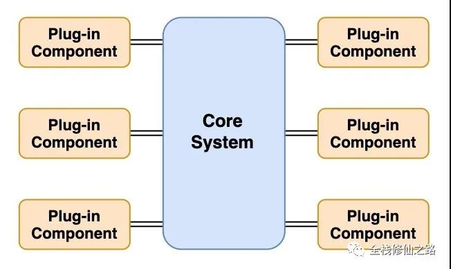

# 架构

## MVC
- 用户向View发出指令
- View告诉Controller要干嘛
- Controller修改Model
- View订阅了Model，Model的修改触发View的更新
- ps: 业务逻辑在Controller中 

## MVP
- 用户向View发出指令
- View告诉Controller要干嘛
- Controller修改Model
- Model告诉Presenter修改了什么
- Presenter触发View的更新
- ps: 业务逻辑在Presenter中 

## MVVM
- View和viewModel中的数据双向绑定，同时变化
- viewModel中的逻辑修改Model
- Model的修改告诉viewModel
- viewModel和View一同更新
- ps: 业务逻辑在viewModel中

## 微内核
微内核架构模式包括两种类型的架构组件：核心系统（Core System）和插件模块（Plug-in modules）  
应用逻辑被分割为独立的插件模块和核心系统，提供了可扩展性、灵活性、功能隔离和自定义处理逻辑的特性  
微内核架构的本质就是将可能需要不断变化的部分封装在插件中，从而达到快速灵活扩展的目的，而又不影响整体系统的稳定  

- 核心
  微内核架构的核心系统通常提供系统运行所需的最小功能集
  核心系统一般是通用业务逻辑，没有特殊情况、特殊规则或复杂情形下的自定义代码  
- 插件
  插件模块是独立的模块，包含特定的处理、额外的功能和自定义代码，来向核心系统增强或扩展额外的业务能力
  尽量减少插件之间的通信以避免依赖的问题  
  ```js
  static install(name, descriptor) {
    if (!Player.plugins) {
      Player.plugins = {}
    }
    Player.plugins[name] = descriptor
  }
  ```