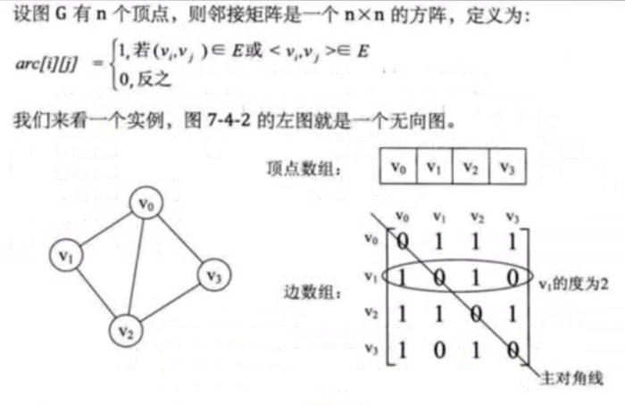
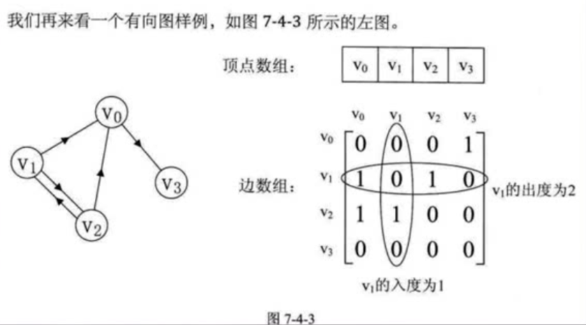
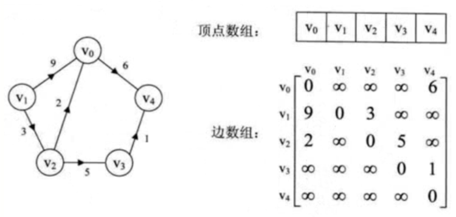
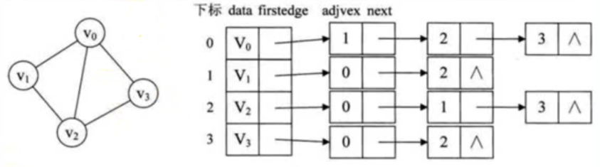
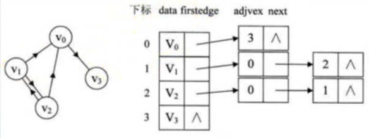
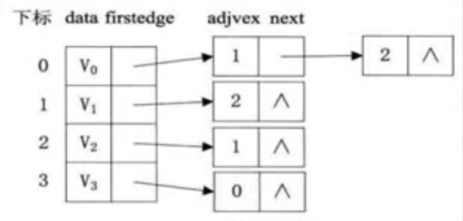
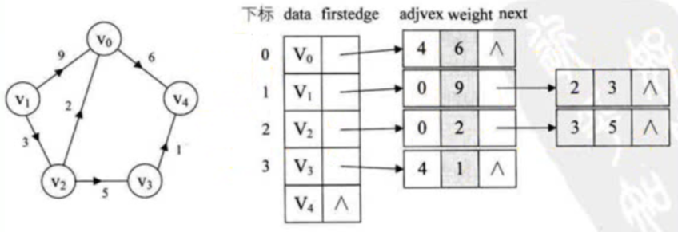

# 数据结构

## 数据
****

##　堆
****

## 栈
是一种只能在一端进行插入和删除操作的特殊线性表  
先进后出的原则存储数据  
****

## 队列
特殊之处在于它只允许在表的前端（front）进行删除操作，而在表的后端（rear）进行插入操作，和栈一样，队列是一种操作受限制的线性表  
****

## 链表
- 单链表
- 双链表
- 循环链表
****

## 树
### 遍历方法
- 深度优先
- 广度优先
****

## 散列表
****

##　图
### 分类
- 无/有向图
- 无/有权图
### 图的一些名称
- 度
  无向：顶点的度为以该顶点为一个端点的边的数目  
        度数之和是顶点边数的两倍
  有向：有向图的全部顶点入度之和等于出度之和且等于边数。顶点的度等于入度与出度之和
  - 入度(有向图)：是以顶点为终点  
  - 出度(有向图)：是以顶点为起点
- 连通：两顶点之间有路径存在
- 连通图：图中任意两顶点都连通，同此图为连通图
- 连通分量：无向图中的极大连通子图
- 强连通：在有向图中，两顶点两个方向都有路径
### 储存
- 邻接矩阵
  邻接矩阵是一个二维数组，数据项表示两点间是否存在边，如果图中有 N 个顶点，邻接矩阵就是 N*N 的数组  
  1. 无向
     
  2. 有向
     
  3. 有向加权
     
  
- 邻接表
  每个单独的链表表示了有哪些顶点与当前顶点邻接  
  对于有向图，可分为出度邻接表和入度邻接表
  1. 无向
  
  2. 有向出度
  
  3. 有向入度
  
  4. 有向加权出度
  