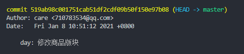

# git 流程规范
   

是以一个git分支的生命周期来规范
- 建立分支
  从master拉取分支
- 分支开发，不断提交
- 分支使用`git merge --squash xxx`合并dev，测试
  测试有问题如何处理：
  1. 当前合并后面没有新的提交
     本地dev回退一个版本，重新合并修改的开发分支  
  2. 当前合并后面有新的提交
     回退自己的提交，把后面的新的重新合并合并进dev
     自己修改完，重新合并
- 分支对应的功能点合并进master，分支删除

### 分支命名
- **分支类型**
  | 分支类型 | 解释 |
  |:-:|:-:|
  | feature | 功能开发 |
  | hotfix | 紧急热修复 |
  | docs | 文档变更 |
  | config | 配置文件修改 |
如果有多个类型的修改，以**feature**、**hotfix**为主  
- **命名规范**
  **type-name-func**    
  例：feature-lj-task-center   任务中心功能开发  
  type：开发分支类型    
  name：开发者名字首字母    
  func：具体的开发任务    

### 代码提交
`git commit -m "xxxx"`
规范提交内容  
- 本地开发提交
  这里提交内容最终会被废弃  
  作用：帮助开发自己明确每次提交的修改内容
  1. day: xxx       日常提交
  2. stage: xxx     阶段提交
  ```bash
  git commit -m "day: 修改商品版块"
  git commit -m "stage: 完成商品版块"
  ```
     
- 合并dev分支提交
  ```bash
  git commit -m "
  version: 1.1.1

  feature: app任务中心版块优化

  修改范围只限于任务中心版块，提取所有任务的配置文件到public/json目录

  项目经理：xxx 产品：xxx 研发：xxx 测试：xxx
  "
  ```
     

### 版本号
> 1.1.1  大号.中号.小号
- **开发任务下达**的时候，指定修改等级  
- **开发完成**
  1. 在dev分支 merge 开发分支的时候，修改版本号，对应等级版本加1  
  2. 在master合并hotfix分支的时候修改版本号，小号加1
     ps：即使是之前撤销的分支重新合并也加1，始终比上一个版本高即可  
- master合并代码的时候
- 删除对应开发分支的远程分支

大中小版本还可以增加  
