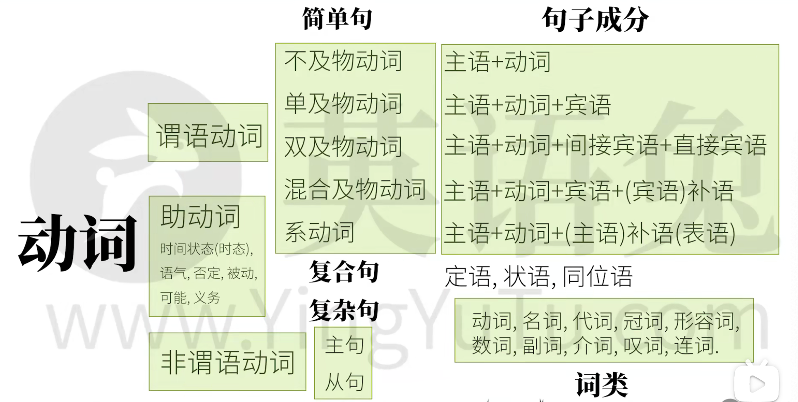

# 五种基本句型

主语 + (不及物)动词
无承受者

主语 + (及物)动词 + 宾语
一个承受者

主语 + (双及物)动词 + 间接宾语 + 直接宾语
两个承受者

主语 + (复杂及物)动词 + 宾语 + (宾语)补语
一个承受者

主语 + (系)动词 + (主语)补语<表语>
赋予信息

# 句子成分
- 主语
- 谓语动词
- 宾语
- 宾语补语
- 主语补语
- 定语
- 状语
- 同位语

# 非简单句
## 名词性从句
### 主语从句
### 宾语从句
### 表语从句
### 同位语从句
## 定语从句
## 状语从句

# 词类
- 名词
- 冠词
- 代词
- 形容词
- 数词
- 副词
- 介词
- 叹词
- 连词
- 动词

# 时态
现在 过去 将来 过去将来
一般 完成 进行 完成进行

# 语气
- 虚拟语气
- 陈述语气
- 祈使语气