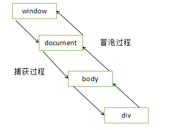

## 绑定事件的三种方式
1. `DOM.onclick = function () {}`  
2. `<input onclick='add()'>`  
3. 事件监听的方式  
```
/* IE */
DOM.attachEvent('onclick', function () {}); //绑定事件
DOM.removeEvent('onclick', function () {}); //取消绑定事件
/* 其他 */
DOM.addEventListener('click', function () {})
DOM.removeEventListener('click', function () {})
/* 所以原生事件不要这个方法来写，有兼容性问题 */
```
ps：在事件处理函数中`return false`来阻止它的默认行为

## 事件流
- 冒泡型事件(都支持)
  阻止冒泡(w3c/IE)：e.stopPropagation() / e.cancelBubble = true
  阻止默认事件(w3c/IE)：e.preventDefault() / e.returnValue = false
- 捕获型事件(IE不支持)


## 常用的事件
- HTML事件
  1. 页面完全加载：load
  2. 页面关闭前：onbeforeunload
  2. 页面完全卸载：unload
  3. 尺寸改变事件：resize
  4. 元素获取焦点：focus (不会冒泡)
  5. 元素获取焦点：focusin (会冒泡)
  6. 元素失去焦点：blue (不会冒泡)
  7. 元素失去焦点：focusout (会冒泡)
  8. 文本内容发生改变：change
  9. 点击from表单里的submit按钮：submit
  10. 选中了文本框里的部分内容：select
- 键盘事件
  1. 按下键盘上的某个键：keydown
  2. 释放键盘上的某个键：keyup
  3. 按下键盘上的某个键并产生字符：keypress
  - 事件相关的属性
    按下的按键的值：event.keyCode
- 鼠标事件
  1. 单击：click
  2. 双击：dbclick
  3. 在元素上移动：mousemove
  4. 移出元素：mouseout
  5. 移入元素：mouseover
  6. 单击任何一个鼠标按键：mousedown
     相关属性
     1. e.button == 0  (鼠标左键)
     2. e.button == 1  (鼠标滚轮)
     3. e.button == 2  (鼠标右键)
  7. 松开鼠标的任意一个按键：mouseup
  8. 鼠标滚轮事件：mouseWheel (火狐不支持)
     事件相关的属性
     1. 基于电脑屏幕：screenX/Y
     2. 基于客户端窗口：clientX/Y
     3. 基于页面：pageX/Y
    4. 基于带有定位的父元素：offsetX/Y
- 拖放事件
  - 被拖拽对象
    1. 元素开始被拖动的时候：dragstart
    2. 在元素拖动时反复触发：drag
    3. 在元素拖动完成的时候：dragend
  - 目标对象
    1. 被拖动元素进入目标元素的屏幕空间：dragenter
    2. 被拖动元素在目标元素内时触发：dragover
    3. 被托动元素没有放下就离开目标元素：dragleave
    4. 被拖放元素在目标元素内放下时：drop
- 移动端事件
  1. 手指触摸到屏幕：touchstart
  2. 手指在屏幕上移动：touchmove
  3. 手指离开屏幕：touchend
  4. 触摸屏幕的行为被系统的某个事件打断了：touchcancel  (一般很少用)
  5. 点击事件：click
  - ps：连续的click事件有200~300ms的延迟，先触发touch事件后触发click事件
  6. 手指在屏幕上滑动：swipt
  7. 手指在屏幕上向左滑动：swiptLeft  
  8. 手指在屏幕上向右滑动：swiptRight  
  9. 手指在屏幕上向上滑动：swiptUp  
  10. 手指在屏幕上向下滑动：swiptDown
  11. 手指碰一下屏幕：tap
  12. 手指长按屏幕：longTap
  13. 手指碰一下屏幕：singleTap
  14. 手指双击屏幕：doubleTap
  - 一般用于代替click事件