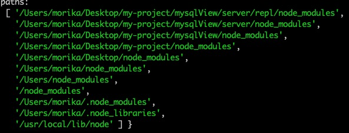

## 导出（module模块）
```
// module.exports 默认是个空对象
// 下面的代码是在对象上挂载属性
exports.xxx = 'xxx'
// 直接修改exports是不允许的，exports是module.exports的引用，直接赋值等于说是改变了exports的引用地址
// 所以，不会生效，真正保存导出变量对象的是module.exports

// 可以为任意类型，但是在模块中只能使用一次
module.exports = XXX


```

## 导入（require模块）
```
const fs = require('fs')
```
- __dirname
  当前模块的目录名
- __filename
  当前文件的文件名
 ```
 // 判断该包是否存在，存在返回包的完整路径，没找到就报错
 require.resolve('a.js')
 ```

## 模块文件的查找顺序（假设导入A）
- ### 相对路径
  `const A = require('./A')`
  1. 在当前目录下查找A.js
  2. 在当前目录的A目录下查看package.json文件且package.json指定了main模块
     `{ "main": "lib/A.js" }`
  3. 如果没有main字段，去A目录下查看是否有index.js文件
- ### 绝对路径
  `const A = require('A')`
  1. 判断是否是核心模块，不是执行后几步，如果和核心模块重名，默认加载的是核心模块
  2. 在当前目录下的node_modules/A.js
  3. 在当前目录下的node_modules/A/package.json(且指定了main字段，同相对路径)，加载main指定路径的文件
  4. 在当前目录下的node_modules/A/index.js
  5. 如果没找到，在上级目录重复以上2、3、4步，再没找到，再向上，如果都没有，报错
  
  实际的查找路径
- ### 文件类型的顺序
  1. js结尾的文件
  2. json结尾的文件
  3. node结尾的二进制

 ## 参考文章
 https://segmentfault.com/a/1190000009060866
