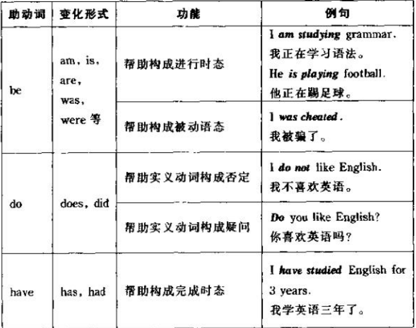
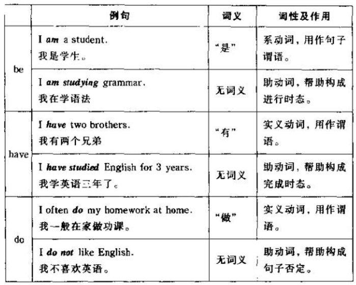

# 动词
1. 实义动词  
	- 具备完整的词汇意义
	- 能单独充当句子的谓语
2. 助动词  
	- 不具备词汇意义
	- 不能单独充当句子谓语，必须和实义动词连用以构成各种时态、语态、语气、否定和疑问等
	be: am is are was were been being  
	do: does did  
	have: has had having  
	   
3. 系动词  
	be  
	have  
	do  
	   
4. 情态动词  
	- 有其自身的词汇意义，如用来表示可能、建议、愿望、必要、允许、能力、怀疑、等等，以表示说话者对某种行为或状态的看法或态度
	- 不能单独作句子谓语，必须和实义动词一起构成复合谓语  
	can: could  
	may: might  
	must  
	shall: should  
	will: would  
	have to  
	ought to  
	used to  
	need to 
	need: dare